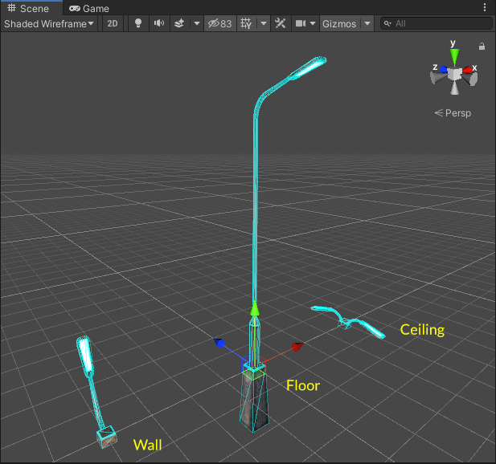
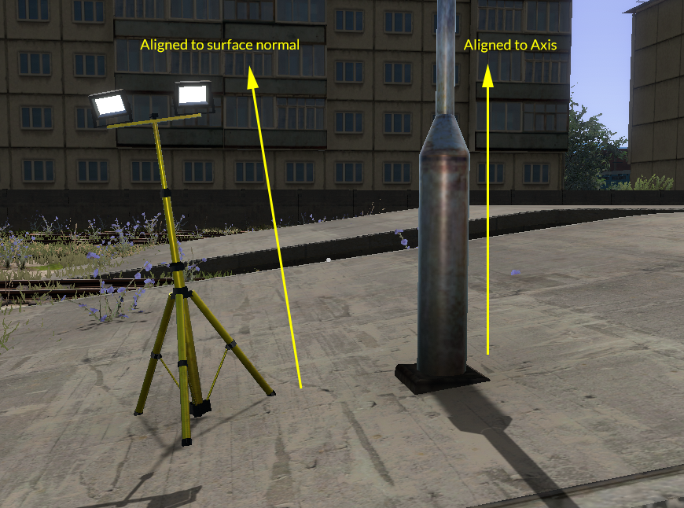
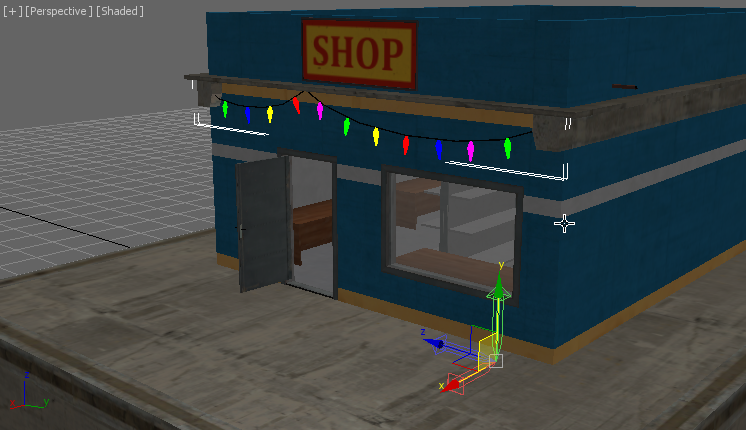
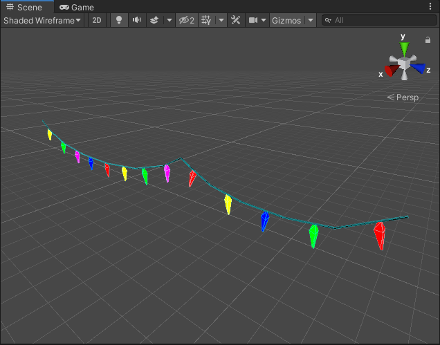
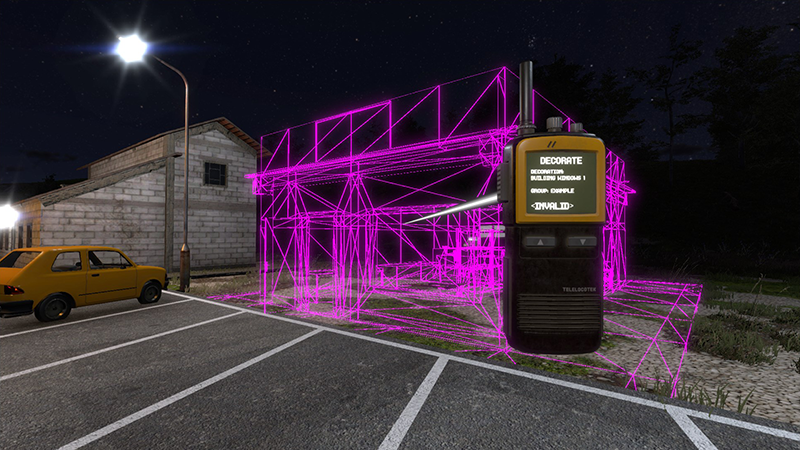
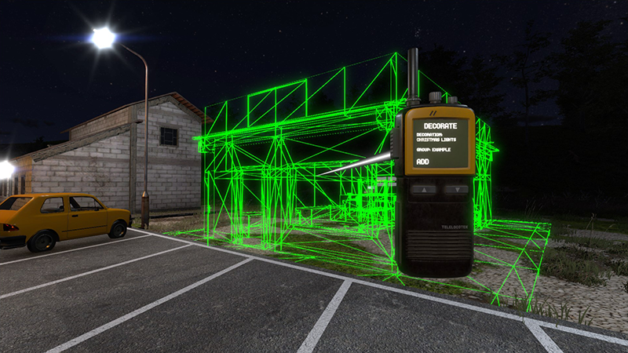
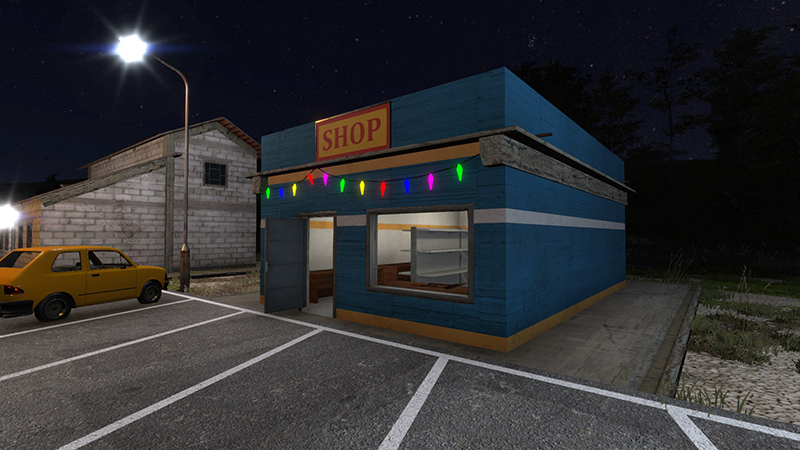

## Adding content to LightSniper

The assets and templates bundled with LightSniper are extracted on first use to allow easy customisation. Asset bundles should be placed in `DVLightSniper\Assets\Meshes` and should be named using the `.assetbundle` extension, though this is not a requirement, just a recommendation.

Sniping spawners into the world is achieved via *Templates* and these are stored in two JSON files under `DVLightSniper\Resources`. The file `templates.lights.json` stores lights and lights with meshes, and `templates.decorations.json` stores decorations.

### Defining Lights

The simplest way to create light templates is simply to make them in-game. Snipe any existing light template, then use the `Designer` mode of the LightSniper comms radio menu to set the desired properties for the light. When you are done, **exit the Designer mode using the `back` option, don't just holster the radio!** Exiting the Designer via the `back` option saves your new light as a template named "`<User Defined>`". You can then use the `LightSniper.SaveTemplate` console command to save this template.

If you prefer to define your lights directly in the JSON, simply copy an existing entry, give it a new name and modify the properties as desired. The benefit with this method is the ability to specify custom duty cycles and snipe offsets.

The following duty cycles are available:

* `Always()` The light is always on (the default)
* `DuskTillDawn()` The light will be on between dusk (as defined in the settings) and dawn, and off during the daytime
* `Flashing(<frequency>)` A light which flashes on and off based on its spawn time at the rate specified by frequency, eg. `Flashing(2.0)` will flash once per second since it will turn on and off *twice* per second.
* `FlashingGlobal(<frequency>,{alternate})` Like `Flashing` but all FlashingGlobal lights with the same frequency will be synchronised. Specifying `alternate` as `true` inverts this light relative to all the others.
* `Sequenced(<timings>)` A sequenced light which takes a sequence of times (specified in seconds). For example specifying (0.2, 1.8) leads to a light which comes on for 0.2 seconds and then stays off for 1.8 seconds, thus having a total cycle time of 2 seconds and flashing very briefly like a strobe. Many sequence elements can be specified to create complex light patterns. For example (0.2, 0.5, 0.2, 0.5, 0.2, 2.0) creates a light which blinks 3 times every 3.6 seconds (the total sequence time is the sum of each element).
* `Random()` A random duty cycle with on and off times between 25ms and 500ms, creates a "broken light" effect like a old flourescent light which can't strike properly.

The "snipe offset" of the template determines the offset from the surface normal used when sniping the light. For example 1.0 will place the light 1m from the sniped position. This can be useful if declaring templates which you want to snipe *inside* the hit object (using a negative value) or away from a surface, eg. for window glows.

### Defining lights with meshes (or just meshes with no lights)

The `meshes` key allows the mesh variants for your light to be defined. The variants are `Floor`, `Wall` and `Ceiling` which correspond to the mesh to use depending on the normal of the hit surface. If the sniped surface does not have a corresponding entry in the variants key, preference fails over in reverse order. For example sniping a mesh on the ceiling with no `Ceiling` mesh defined, will first try to use the `Floor` mesh, and if that is not defined then `Floor` will be used. You should always at least define `Floor` for this reason.

When creating your mesh prefabs, the following orientation rules should be followed:

* `Floor`: "up" ***away from the sniped surface normal*** is aligned with positive Y. The player's facing direction when placing is aligned with positive Z. Usually you should orient prefabs so that the front faces the player (eg. "forward" for the mesh is towards negative Z)
* `Wall`: ***away from the sniped surface normal*** (which is a wall so will be vertical) and therefore also **toward the player** is aligned with positive Y. "up" which is orthogonal to the player's facing direction and the wall normal should be aligned with positive Z. In other words *Wall* prefabs should be "lying on their back" as if the XZ plane is the wall, with "up" facing positive Z.
* `Ceiling`: ***away from the sniped surface normal*** which will be "down" once placed is aligned with positive Y. The player's facing direction is aligned with positive Z. In other words, *Ceiling* prefabs should be "upside down".

This seems a bit odd but the best way to think about it is that the XZ plane in the editor *always represents the sniped surface*.



Note that LightSniper moves and rotates the root prefab transform when sniping so to get the correct orientation when sniped you should ensure your prefab transform has rotation of (0,0,0,0) in the scene, since rotations applied to the prefab will be overridden when the mesh is placed in the world. If you need to rotate the mesh itself then attach it to an empty parent object which acts as the root of the prefab, and rotate the child object.

If you want to attach lights to your prefab, create empty objects parented to the root of the prefab named `LightOffset(n)` where `n` is the light offset (not currently used but will be in the future) starting at 0. The offset markers *must* be attached to the root object (the spawner does not search the object hierarchy) and must be named correctly. Lights from your template will then be added to the prefab when it is sniped into the world. You can of course add `Light` components to your prefab, but LightSniper will not then manage the lights independently, so it won't be possible to modify the lights in-game or leverage features such as duty cycles.

Add your prefabs to an asset bundle and export it, once you have done this you can add them to the template JSON. Place your compiled asset bundle into the `DVLightSniper\Assets\Meshes` folder.

#### Adding a template entry for your asset

Specifying the meshes for your asset bundle is fairly straightforward. Let's take a look at the built-in "Street Lamp" template:

```json
{
  "name": "LAMP POST",
  "lights": [
    {
      "type": "Point",
      "intensity": 1.0,
      "range": 20.0,
      "colour": "#DDEEFF",
      "corona": {
        "sprite": "corona_flare02.png",
        "scale": 1.0,
        "range": 100.0
      },
      "dutyCycle": "DuskTillDawn()"
    }
  ],
  "meshes": {
    "Floor": {
      "properties": {
        "file": "meshes_lampposts.assetbundle",
        "mesh": "LampPostSmall_Floor"
      },
      "alignment": "AlignToAxis"
    },
    "Wall": {
      "properties": {
        "file": "meshes_lampposts.assetbundle",
        "mesh": "LampPostSmall_Wall"
      }
    },
    "Ceiling": {
      "properties": {
        "file": "meshes_lampposts.assetbundle",
        "mesh": "LampPostSmall_Ceiling"
      }
    }
  },
  "snipeOffset": 0.1
},
```
Note that there is only one light defined, even though the `Ceiling` variant of the mesh has two offsets. If there are more offsets than lights in the template then the lights are assigned in round-robin fashion to each offset in order. In other words, if you define 2 lights but there are 4 offsets, then the lights will be assigned 1, 2, 1, 2.

As you can see, assigning the prefabs to the template is as simple as assigning the `file` and `mesh` properties for the `properties` block of the mesh template. Where `file` is the filename of your asset bundle, and `mesh` is the name of the prefab to use.

The `alignment` setting only applies (currently) to meshes placed on the floor and determines whether the mesh will align with the Y axis for "up" (useful for meshes which should always be vertical, like lamp posts and other small structures) or aligned with the surface normal (`AlignToNormal`) which is more suitable for objects which should behave like they're placed on the ground:



For meshes which are aligned to axis, it's usually a good idea to extend the mesh below the XZ plane so that placing the mesh on an uneven or slanted surface doesn't cause part of the mesh to end up floating in space.

### Defining Decorations

Decorations are different to standalone meshes in that decorations are always applied to an existing mesh in the game. LightSniper uses decorations primarily to add lit windows to existing buildings, but you can use them to add any additional geometry or textures that you wish.

As a canned example, we'll look at a simple decoration for the item shop.

#### Creating your decoration

The first step in creating a decoration is to extract the mesh you want to decorate from the game assets. Once you have imported the mesh into your 3D program of choice, reset the mesh transform to the origin and use it as a guide for designing your mesh.

> Note that in game engines, it's common for XY to be the plane of the screen/camera, with Z extending away from the camera, this means that Y is usually "up", whereas your 3D program may use a different coordinate system with the Z axis being "up" (or you may be able to choose), just be aware that when you're designing assets, you may need to rotate the mesh 90° around the X axis to orient it correctly in your viewport. **If you do this, ensure that your decoration has the same transform applied!**

Here I've designed some simple low-poly christmas fairy lights for the item shop:



Note that the origin for the decoration mesh is also at (0,0,0) and that the transform is oriented with Y pointing upward. Ensure the local transform of the mesh is correct before you export it.



Once you import your mesh to unity, if you need to make further changes such as assigning materials, add it to the world and modify it, then create a prefab once you're happy. Assign the prefab to an asset bundle and export it. Place the exported asset bundle into `DVLightSniper\Assets\Meshes`.

#### Defining the decoration template

Decoration templates are stored in `DVLightSniper\Resources\templates.decorations.json`.

Decorations are defined in two parts: declaring the decoration group and ID, and defining *targets* for the decoration. Let's look at an existing decoration to see how this works:

```json
{
  "id": "TRAFFIC_LIGHT:GREEN",
  "name": "Traffic Light Green",
  "targets": [
	{
	  "target": "TrafficLight01_LOD",
	  "mesh": {
		"file": "meshes_decoration_lights.assetbundle",
		"mesh": "TrafficLight01_GreenLight"
	  }
	},
	{
	  "target": "TrafficLight03_LOD",
	  "mesh": {
		"file": "meshes_decoration_lights.assetbundle",
		"mesh": "TrafficLight03_GreenLight"
	  }
	}
  ]
}
```

* The **ID** for the decoration consists of two parts separated by a colon (`:`). The part before the colon is the *group* and is optional, the part after the colon is the decoration ID. Specifying a *group* tells *LightSniper* to only apply one of the decorations in this group at a time. For example it doesn't make sense for traffic lights to be both green and red, so the decorations are defined as `TRAFFIC_LIGHT:GREEN` and `TRAFFIC_LIGHT:RED`. If the user tries to apply `TRAFFIC_LIGHT:GREEN` when `TRAFFIC_LIGHT:RED` is already applied, *LightSniper* will *swap* the decoration instead.
* The **name** for the decoration is what will appear on the comms radio and can be any text you like
* The **targets** for the decoration define which meshes the decoration can apply to, and which prefab to apply for each. This is to allow the "same" decoration to apply to different meshes without forcing the user to select a different decoration for each different target. In this case `TRAFFIC_LIGHT:GREEN` has prefabs which can apply to both `TrafficLight01` and `TrafficLight03`, so both are defined as targets.

So now let's define a template for our christmas lights:

```json
{
  "id": "CHRISTMAS_LIGHTS",
  "name": "Christmas Lights",
  "targets": [
	{
	  "target": "@Shop (1)",
	  "mesh": {
		"file": "example_decorations.assetbundle",
		"mesh": "ItemShop_ChristmasLights"
	  }
	}
  ]
}
```

As you can see, the GROUP part of the ID is optional, we don't want this decoration to be exclusive with any other type so we just specify a bare ID. We have only declared one target since we haven't made variants of our christmas lights for any other objects (yet).

The **target** specified can match either a *renderer* name (in the traffic light example above, it was matching `TrafficLight01_LOD`) or a *transform* name - prefixing the target with `@` causes LightSniper to match transform names. All matches are evaluated as `StartsWith`, so `TrafficLight01_LOD` matches both `TrafficLight01_LOD0` and `TrafficLight01_LOD1`.

### Applying the decoration

Having added the asset bundle and defined our template, we can now go ingame and test it. In `DECORATE` mode under the LightSniper comms radio mode, hovering over the desired target should now highlight it in purple, indicating that a decoration is available but not selected:



Scroll down until you find your new template and the highlight should turn green, indicating the template can be applied to the target:



Click to apply the template and the decoration should now appear:



#### Material Assignment Decorations

Decorations can also be used to apply new material layers to existing meshes. The process for material assignments is similar to mesh-based decorations:

1. Extract the *material* for the object you wish to modify from the game assets to use as a base
2. Design your overlay and import it into Unity as a Texture asset
3. Create a material using the imported texture, and assign the appropriate shader you wish to use.
4. Create an empty GameObject with a mesh renderer (for example a cube)
5. Assign the material to the mesh renderer.
6. Create a prefab from the GameObject, assign the prefab to your asset bundle, and then export it.

Next define your template, specifying the prefab name and the details of the material you wish to assign:

```json
{
  "id": "EXAMPLE_MATERIAL_DECORATION",
  "name": "Example Material Assignment",
  "targets": [
	{
	  "target": "@some_target_gameobject",
	  "mesh": {
		"file": "example_decorations.assetbundle",
		"mesh": "some_target_gameobject_extramaterial",
		"assignMaterials": {
		  "hideSourcePrefab": true,
		  "assignments": [
			{
			  "renderer": "NameOfTargetLODRenderer",
			  "fromIndex": 0
			}
		  ]
		}
	  }
	}
  ]
}
```

Notice that the assignMaterials key takes an array of assignments to make, specifying the name of a target renderer on the specified target game object, for example this might be `SomeObject_LOD0` as the child renderer to target. `fromIndex` specifies the offset in the materials array from our decoration prefab. If you wish to target multiple LOD renderers, you can apply materials for each to your source prefab and then specify different `fromIndex` values to pick the correct material.

The `hideSourcePrefab` defaults to true and tells LightSniper to simply copy the materials and then hide the source prefab. However you can use `assignMaterials` in conjunction with regular decorations, so you may wish to set this to `false` to both apply a decoration mesh, and assign a material from your prefab to the decorated target.
