**LightSniper** is a mod for [Derail Valley](http://www.derailvalley.com/) designed as a companion to [*Procedural Sky*](https://www.nexusmods.com/derailvalley/mods/194) by [*CybexGS*](https://www.nexusmods.com/derailvalley/users/93913498) and inspired by [*Extra Lights*](https://www.nexusmods.com/derailvalley/mods/323) by [*Katy Fox*](https://www.nexusmods.com/derailvalley/users/91212218).

*Procedural Sky* makes DV much more immersive with night time and weather effects, but as a result of there being no lighting in the towns and rail yards, the DV world ends up feeling a little dead. **LightSniper** aims to address this by allowing the player to light up their own DV world and share their lights with others, essentially the mod is *__Extra__ Extra Lights*.

## Screenshots
[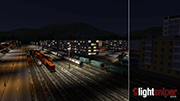](docs/img/comparison1.png) [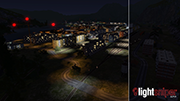](docs/img/comparison2.png) [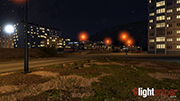](docs/img/screenshot_csw1.png) [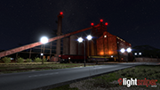](docs/img/screenshot_sm1.png) [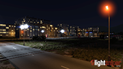](docs/img/screenshot_hb1.png) [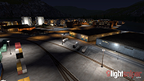](docs/img/screenshot_hb2.png) [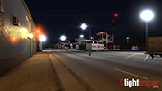](docs/img/screenshot_hb3.png) [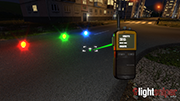](docs/img/create.png) [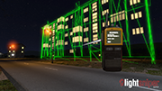](docs/img/decorate.png) [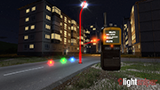](docs/img/delete.png) [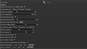](docs/img/settings.png)

## Features
* Place ("snipe") light sources into the Derail Valley world using a new menu in the comms radio
* Place meshes with lights attached, for example lamp posts and flood lights
* Place "decorations" on existing meshes to simulate lit up windows on buildings, glowing traffic lights, etc.
* All placed lights, meshes and decorations stored in JSON files for easy sharing/backup
* Performance options such as rendering radius for lights and meshes, and background refresh rate
* Adds the same player glow as *Extra Lights* so you don't lose out on the player glow if you're not running *Extra Lights* (automatically disabled if *Extra Lights* is detected)

**Advanced features include**

* Modify all properties of placed lights including intensity, colour, range and visible corona
* Define "duty cycle" for placed lights, for example flashing, flickering or enabled only at night
* "Paint" (paste) light properties to existing lights
* Place temporary helpers such as grids, measuring tapes and 'struts' into the world to help with spacing lights or putting lights in places where there is no geometry to snipe onto (eg. in mid-air)
* Bundle your lights into .zip "packs" for easy sharing with your friends (and enemies)

## Quick Start
* Install [**Unity Mod Manager**](https://www.nexusmods.com/site/mods/21)
* Install [**Procedural Sky**](https://www.nexusmods.com/derailvalley/mods/194)
* Install [**Functional Clocks Continued (DVTime)**](https://www.nexusmods.com/derailvalley/mods/281) - this is required for Procedural Sky
* Install [**Extra Lights**](https://www.nexusmods.com/derailvalley/mods/323) (Optional)
* Install LightSniper

If you want to place your own lights, just go ahead and use the new LIGHTSNIPER mode in the comms radio. If you wish to use the LightSniper bundled lights, open the console and run the command

```
LightSniper.InstallPack default
```

This will unpack and enable the default lighting pack. Note that it may take up to a minute for lights to load in once you install the default pack so don't panic if nothing happens immediately.

If you want to install the level crossings as well, run the console command:

```
LightSniper.InstallPack level_crossings
```

## Credits
Main credit goes to [*Katy Fox*](https://www.nexusmods.com/derailvalley/users/91212218) for *Extra Lights* which provided the main inspiration for making this mod, and [*CybexGS*](https://www.nexusmods.com/derailvalley/users/93913498) for making *Procedural Sky* in the first place, without which this mod would be kind of pointless.

## FQA
**Where are my sniped lights and meshes stored?**
> LightSniper stores everything in JSON files under the `DVLightSniper` mod directory. Sniped lights, meshes and decorations are stored under `Derail Valley\Mods\DVLightSniper\Regions\REGIONID\GROUPID.json` where `REGIONID` is the region where you sniped the light (eg. for *Goods Factory* this is `GF`) and `GROUPID` is the name of the group (the default is `user`).

**What do all the options do?**

> * **Enable LightSniper Comms Radio Mode**
>
>   Enables and disables the "LightSniper" mode in the comms radio. Useful if you have finished editing lights and would rather not have the option cluttering up your comms radio.
>
> * **Corona Opacity (%)**
>
>   Sets the opacity of the corona effects on lights (lens flares, kind of). Setting the opacity to 0 disables the coronas entirely if you want to improve performance or if you just don't like them.
>
> * **Enable Player Glow**
>
>   LightSniper was inspired by the [Extra Lights Mod](https://www.nexusmods.com/derailvalley/mods/323) which adds extra lights to the offices and adds a "glow" component to the player to help them see. If you are using LightSniper in conjunction with *Extra Lights* then `Auto` will disable the glow automatically. Otherwise you can choose to have the player glow enabled or disabled if you are not using *Extra Lights*.
>
> * **Player Glow Intensity**
>
>   Sets the intensity of the player glow (if enabled)
>
> * **Enable Distance Culling**
>
>   Disabling this option will render all active spawners regardless of their distance from the player. This can be pretty cool (you can see the *Farm* from *Steel Mill*) but in areas such as Harbor this may lead to a noticable drop in framerate. You may wish to disable this option if your PC is a beast, if you are not using many lights, or if you want to take screenshots at night.
>
> * **Distance Culling Radius**
>
>   Sets the range at which spawners are culled (hidden), the default value of 400 is a good starting point, but you may wish to increase it if your PC is powerful, or decrease it if you are experiencing a drop in framerate.
>
> * **Spawner Update Strategy Tune**
>
>   This scary-sounding option lets you control how much time LightSniper is allowed to spend searching for spawner anchors. Since LightSniper is adding objects to the world dynamically, it has to search for the parent transforms in the background based on the region you're standing in. Normally the `Lazy` option works best, which keeps the searching very lightweight and shouldn't impact game performance. The trade-off is that if you travel across the world too quickly then you may arrive before LightSniper has spawned all the meshes and lights so they may "pop in".
>
>   However increasing the strategy tune puts more strain on the game engine as LightSniper will perform more searches, this may cause stuttering of the game as you approach new areas. If you don't mind a bit of stuttering but would rather have lights load more aggressively, you can select a higher setting. `NukeItFromOrbit` removes all limits and may make the game hang for several seconds when visiting new areas. Use the option only when necessary.
>
> * **Update Tick Rate (ticks/s)**
>
>   Sets the desired maximum update rate for LightSniper, you may wish to reduce the value on older PCs, this value also interacts with the *Spawner Update Strategy Tune* to control how aggressively LightSniper searches for parents. For example reducing this value but increasing the tune will run larger searches less often.
>
> * **Light Render Mode**
>
>   Sets the [render mode](https://docs.unity3d.com/ScriptReference/Light-renderMode.html) for spawned lights. Pixel lights look better but have a higher performance impact, whereas vertex lights are more performant. The default setting "Auto" usually looks fine.
>
> * **Dawn Time (Hour)** and **Dusk Time (Hour)**
>
>   For the `DuskTillDawn` duty cycle, this option sets when the duty cycle will consider dusk and dawn to be. All lights using this duty cycle will turn on or off *within 10 minutes* (chosen at random) of the specified time. For example setting dawn to 6:00 will cause lights to turn off between 5:50 and 6:10.
>
> * **Enable Enhanced Mesh Placer (Modifier Keys)**
>
>   When placing meshes, the player's alignment and the surface normal are used to orient the mesh, usually toward the player. Enabling this mode allows `SHIFT` and `CTRL` (configurable) to modify the snipe direction: pressing CTRL will turn the snipe 90°, and pressing `SHIFT` will flip it 180° (pressing both will result in a 270° rotation).
>
> * **Enable Decorate Mode**
>
>   Enables the `Decorate` option in the LightSniper comms radio menu, allowing you to place decorations.
>
> * **Enable Designer Mode**
>
>   Enables the `Designer` option in the LightSniper comms radio menu, which allows you to adjust the properties of individual lights such as range, intensity, colour and corona.
>
> * **Enable Helpers Mode**
>
>   Enables the `Helpers` option in the LightSniper comms radio menu, which allows you to place helper objects in the world to help you place lights and meshes more accurately
>
> * **ROTATE Orientation** (Key Binding)
>
>   Defaults to `CTRL`, see the previous setting.
>
> * **SHIFT Orientation** (Key Binding)
>
>   Defaults to `SHIFT`, see the previous setting.

**What are the LightSniper console commands?**

> LightSniper supports a number of console commands which can be used when placing lights:
> * **`LightSniper.BeginGroup {groupid}`**
>
>   Sets the current *group* to the specified value. The group id cannot contain spaces. Setting a group using this command means that all sniped lights and meshes will be stored in the specified group until the `EndGroup` or another `BeginGroup` command is issued.
>
> * **`LightSniper.EndGroup`**
>
>   Sets the group back to the default `user`
>
> * **`LightSniper.DisableGroup [groupid]`**
>
>   Disables the specified group, all lights and meshes in the group will be removed from the world. If you do not specify a `groupid` then ALL groups will be disabled. To disable a group in only a specific region, use `LightSniper.DisableGroup [regionid] [groupid]`. Groups within a pack are prefixed with the pack ID followed by a colon "`:`, so if you want to disable the group `example` inside a pack with id `spam`, use `LightSniper.DisableGroup spam:example`
>
> * **`LightSniper.EnableGroup [groupid]`**
>
>   Enables the specified group (like `DisableGroup` omitting the group name enables all groups)
>
> * **`LightSniper.SetRegion [regionid]`**
>
>   Forces the region to the specified value instead of using the nearest region. This can be used when working in overlapping regions (eg. HB and HMB or MF and MFMB) to force LightSniper to select the specified region when saving sniped lights. This value is not persisted if you close the game.
>
> * **`LightSniper.SaveTemplate {template name}`**
>
>   When editing lights with the *Designer* mode, cleanly exiting the designer (using the "Back" menu option instead of just holstering the radio) will save a new template called `<User Defined>`. If you wish to save this template with a more user-friendly name, use this command. The template name can contain spaces but should be fairly short so that it fits on the comms radio display.
>
> * **`LightSniper.ReloadTemplates`**
>
>   Reloads templates from the files on disk, this can be useful if you have edited the JSON file using an external editor and wish to reload your changes without restarting the whole game.

**Does LightSniper modify the level? Can it cause corrupted saves?**

> LightSniper adds everything to the game at runtime and does not modify the save game. When new spawners are created, LightSniper records 3 things in a JSON file: a "parent" transform path which describes where you hit, this will be used to find the transform next time you load the game; the details of the spawner you sniped, such as the light properties and the mesh to use; and the offset of the spawner from the parent.
>
> For example, if you snipe a light onto the side of a building, LightSniper will record the building's transform path, the light properties, and the offset of the light relative to the building's origin.
>
> Since LightSniper does not modify the save game, removing the mod will prevent all objects from spawning. Likewise deleting the JSON files (or individual entries inside) will stop sniped lights/meshes from spawning. Like any mod LightSniper can still cause crashes - though I hope it doesn't - and this may affect your save indirectly. However DV is very good at creating backups of your save game so this shouldn't be a catastrophe if it does happen.

**Does LightSniper affect performance?**

> Just having the mod installed will not cause any noticable impact on performance, however once LightSniper has some spawners defined, it can affect performance in two ways:
>
> 1. LightSniper periodically scans the world for parent transforms of defined spawners, see the settings section above on how the *Update Strategy Tune* and *Desired Tick Rate* can be used to control how much time LightSniper spends searching for parent transforms
>
> 2. Once a spawner is active (has found its parent) it adds new objects to the world. The performance impact is directly proportional to the number of objects spawned. See the next section for how you can improve performance if you have lots of active spawners

**I have lots of lights and meshes and my framerate is dropping. How can I improve performance?**

> The most useful option to control performance is the *Distance Culling Radius*. This affects how far away spawned lights and meshes can render. If your PC is struggling to render a lot of objects, you can reduce the radius to reduce the load.
>
> Another option is to selectively enable and disable certain groups to keep some lights enabled but disable others. All of the lights in the included light pack are split into different groups and you can enable and disable them using the console commands.

**Sometimes when I snipe a light, the game pauses for a second and appears to freeze, then carries on as if nothing happened. What gives?**

> In order to reliably respawn lights, LightSniper applies some restrictions to the type of object it can choose as a "parent" transform. If the hit object is not suitable then LightSniper will attempt to resolve a suitable transform in the hierarchy of the hit object. However if this is still not suitable then LightSniper will search inside a large radius to find an object to hook onto. This search can be quite expensive and may take a couple of seconds, this is what causes the game to freeze briefly. This is most likely to happen when sniping onto terrain rather than onto a mesh.

**Are there any shortcut keys when using LightSniper?**
> Yes, the following keys can be used:
>
> * In **Place**, **Delete** and **Helpers** mode, `CTRL+Z` will undo the last action.
> * In all modes, the following keys can be used to quickly switch to a different mode:
>   * `INSERT` switches to **Place** mode
>   * `DELETE` switches to **Delete** mode
>   * `HOME` switches to **Paint** mode
>   * `END` switches to **Designer** mode (if enabled in the settings)
>   * `PAGEUP` switches to **Decorate** mode (if enabled in the settings)
>   * `PAGEDOWN` switches to **Helper** mode (if enabled in the settings)

**How do I share my lights with other people?**

> Once you've created lights you want to share, sharing them is as simple as creating a zip file containing your `DVLightSniper\Regions` folder and a file called `Info.json` which should contain the following:
> ```json
> {
>   "Id": "PACK_ID",
>   "DisplayName": "Your Pack Name",
>   "Author": "Your Name",
>   "Version": "1.0"
> }
> ```
> Fill in the appropriate details for your pack, the ID will be used to differentiate your groups from the user's own groups when they use your pack. That's it, you can now share your pack with others and they can use it by simply dropping the pack into the `DVLightSniper\Packs` folder. Alternatively they can extract your zip file into their own `DVLightSniper` folder to allow editing regions.

**I'm a modder, can I add my own assets to LightSniper?**

> Absolutely! LightSniper simply adds prefabs from an asset bundle into the the world based on a *template* defined in the templates JSON file. Simply create your asset bundle and place it in the `Assets/Meshes` folder then add your template definition to the templates JSON in the `Resources` folder. You can copy an existing entry and modify the asset bundle name accordingly. Light offsets are specified in object coordinates but you don't have to define any lights if you just want to place a mesh in the world. See [MODDING.MD](./MODDING.MD) for more details.

**I'm not _using Procedural Sky_, can I use LightSniper to add things which aren't lights?**
> Yes, you can define templates with no lights if you want. This essentially just lets you place any prefab into the world and LightSniper will manage spawning and despawning it. See [MODDING.MD](./MODDING.MD) for more details.

**Why does LightSniper have to search in the background for parents? Couldn't it just run the scan all at once when the game loads?**
> Since the Derail Valley world is so large, not all areas of the map are loaded all the time. In fact the world itself actually moves underneath you as move around, with tiles of the world loading and unloading as you move away from them.
>
> This means that if you snipe a light onto a building in *Steel Mill*, once you move far enough away the building itself will de-spawn, along with your light. Once you go back the building gets loaded back in again. LightSniper stores a path - basically an address - for the building in the *Steel Mill* (SM) region file, for example:
> ```
> /Far__x7_z6/Far__x7_z6_LFS/Far_Station_SteelMillIndustry/IndustryBuildings (1)/Warehouse_MediumFlat
> ```
> It can then use this "address" to find the same building again once you go back in range (the range of each region is 1000m from the station building in all directions). However, searching for objects like this is pretty expensive, and while searching for one or two addresses each frame would be ok, searching for tens or hundreds would cause the game to stutter like crazy. This is why LightSniper limits each spawner to one search every 5 seconds, and limits the total number of updates per frame to a very low number (3) by default.

**If searching for transforms is so expensive, why not just record the absolute world position and ise that?**
> The idea of storing a nearby transform by path is to provide a more stable way of recording sniped spawners in the long run. If AltFuture decides to move a building a couple of metres to the left, any lights sniped on it should move too. The idea for future versions is to create migration bundles providing a mapping of old transforms to new ones, so that any changes to the map don't force everything to be re-created from scratch.
>
> What this means is that I've chosen the slightly more complex approach in an effort to make things better in the long run. We'll have to wait and see whether it works out.

**You keep using the word "spawner", but what is that?**
> A *spawner* is the record of your sniped light, mesh or decoration which looks after searching for the parent transform, spawning the object once the parent is found, and culling the object when it's out of range. Spawners for all sniped objects always exist, though they are dormant when out of range of the *region* that contains them.

**If the range of the region is 1000m from the station building, how can I snipe things outside of the yard?**
>As well as the named regions, the entire map is covered in a special region called `WILDERNESS` which is split down into 1km² tiles. Any objects you place outside of a named region will end up in `Regions\WILDERNESS\TILE_Xxx_Zzz` where the X and Z define the location of the tile in world space.
